# GitPerennial

> *"GitHub's traffic data is an annual. We made it perennial."*


**Originator & Architect:** Kirk Shallcross - Shallcross Consulting  
**Implementation Specialist:** Anthropic Claude AI / Claude Code  
**Inception Date:** September 2026  
**Version:** 1.0.0

Self-hosted GitHub traffic & release analytics that outlasts GitHub's
14-day history. GitPerennial runs on your own machine, keeps its own
data in its own local database, and uses your own GitHub token —
nothing about your repos, your traffic, or your data ever leaves your
computer.

## Architecture at a Glance

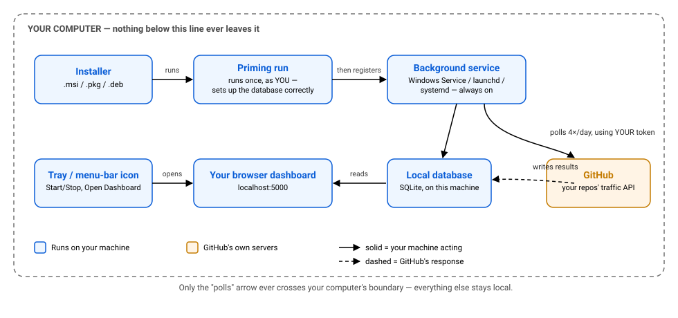

Only the "polls" step ever leaves your computer — everything else,
including your data, stays local.

## Download GitPerennial

**Don't clone or download this repository to run the app.** This repo
contains documentation and license information only — the installers
are on the **[Releases page →](https://github.com/SC-Admin567/GitPerennial/releases)**.
Click there, download the installer for your operating system, and run
it.

| Platform | Installer |
|---|---|
| Windows | `GitPerennial.msi` |
| macOS | `GitPerennial.pkg` (Apple Silicon only — see [System requirements](#system-requirements)) |
| Linux | `gitperennial.deb` (Debian/Ubuntu family, amd64 — tested on Ubuntu 24.04; see [System requirements](#system-requirements)) |

**Linux note:** GitPerennial ships as a `.deb` for v1.0, built for
64-bit Intel/AMD (amd64) machines — ARM machines (Raspberry Pi, ARM
cloud instances) aren't supported yet. If you're on Fedora, RHEL,
openSUSE, Arch, or another non-Debian-family distro, a `.rpm` package
is planned as a fast-follow release — it isn't available yet.

**Already installed and want to know how to actually use the app —
what the dashboard shows, what Settings and Archive do?** See
[QUICKSTART.md](QUICKSTART.md).

## Why GitPerennial

GitHub's own Traffic API (clones, views, referrers, popular content)
only keeps a rolling **14-day** window. Once that data ages out, it's
gone — GitHub itself has no way to get it back. GitPerennial polls your
repos on a fixed schedule and keeps a permanent, growing history in a
local database on your own machine, so you never lose that visibility
again.

- **Own it forever.** One-time purchase. No subscription, no monthly
  fee, no dependency on us staying in business. The version you buy
  keeps working for as long as you want it to — nothing phones home to
  check if you paid, nothing gets locked out if you never renew.
- **Free tier, forever.** Track one repo at full feature depth, with no
  time limit and nothing crippled. A license is only needed to track a
  second repo and beyond.
- **Self-hosted, not SaaS.** Your GitHub token and your data stay on
  your own computer. We never see either.

## Screenshots

*(Captured from a real running install, tracking GitHub's own public
`octocat/Hello-World` example repo — not a live customer's data.)*

**Dashboard**

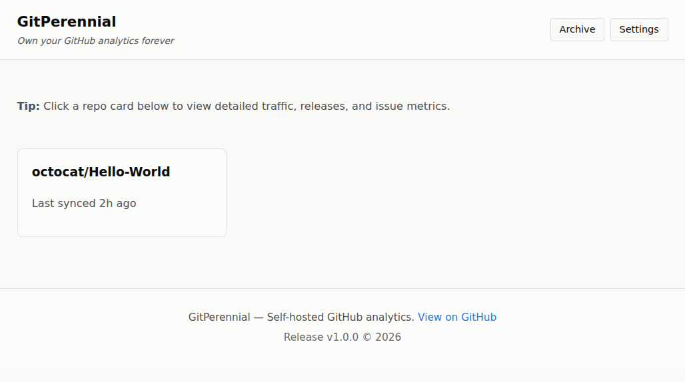

**Traffic**

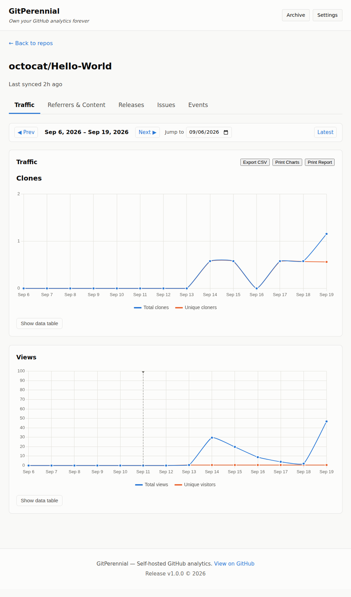

**Gap detection — this is the whole point of the product.** GitHub
only keeps 14 days of traffic history; if your computer is ever off
when a poll was due, GitPerennial doesn't just silently show a hole in
the graph — it tells you exactly why each day is missing, and
automatically recovers once it catches up:

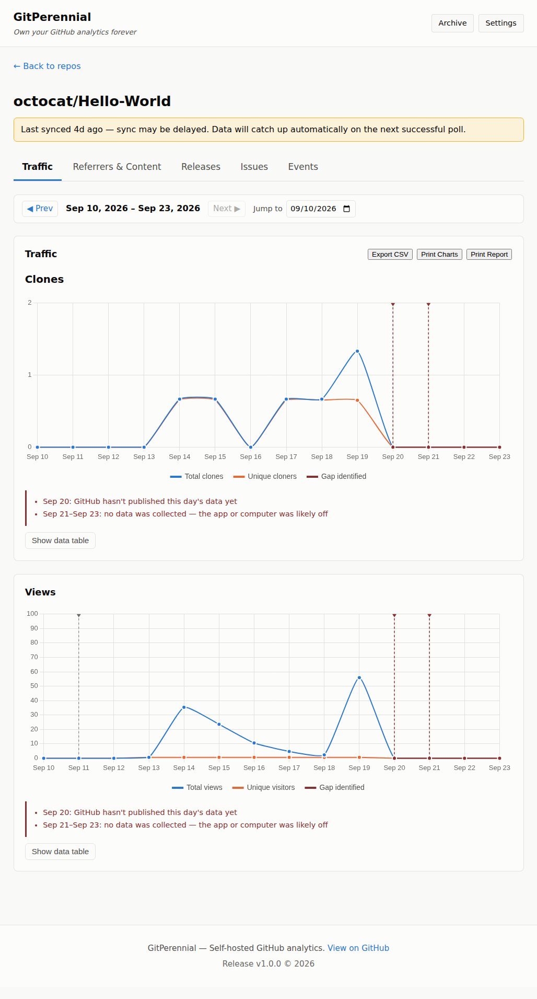

**Referrers & Content**

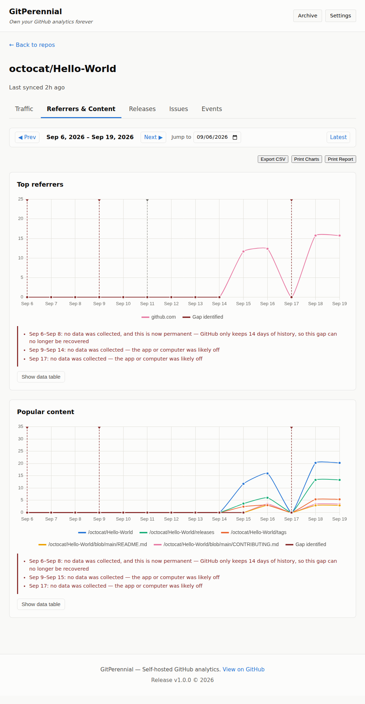

**Releases**

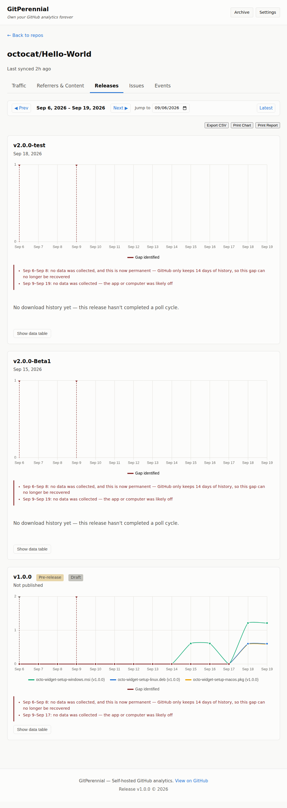

**Issues**

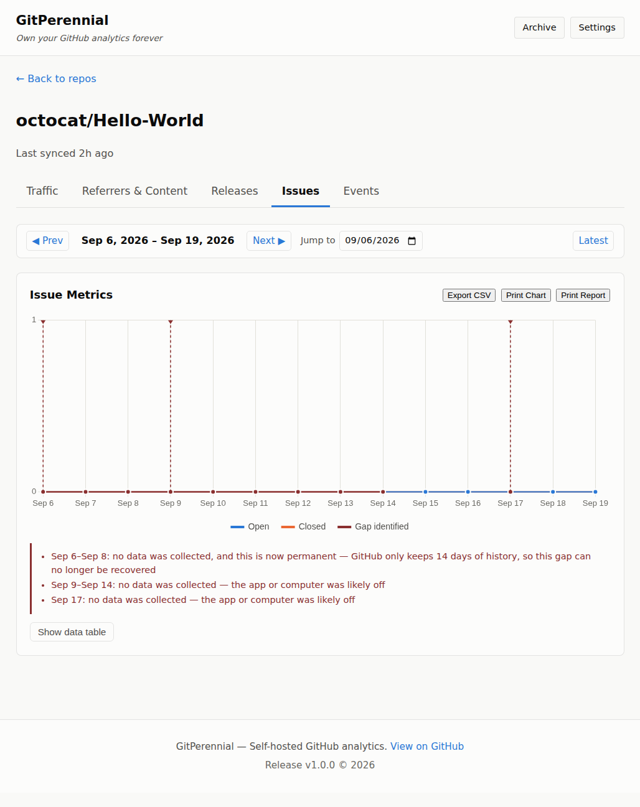

**Events**

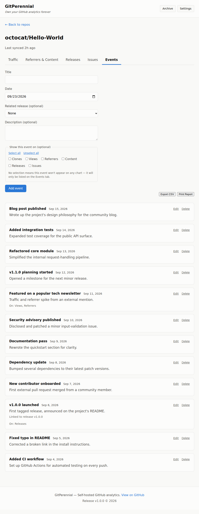

**Settings**

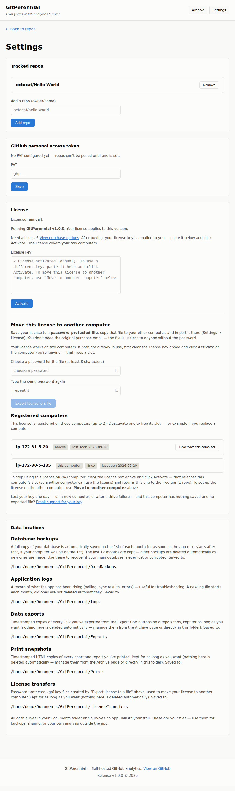

**Archive**

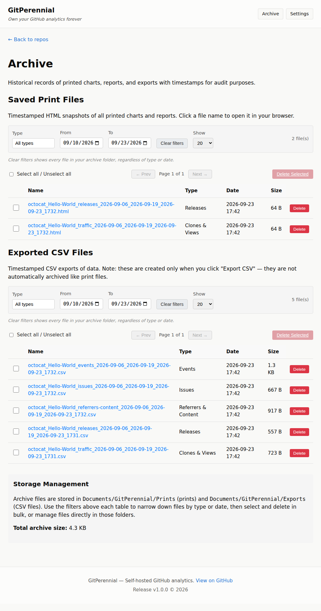

Click any exported CSV's name in the Archive to view it right in your
browser, formatted as a table — no need to open the raw file:

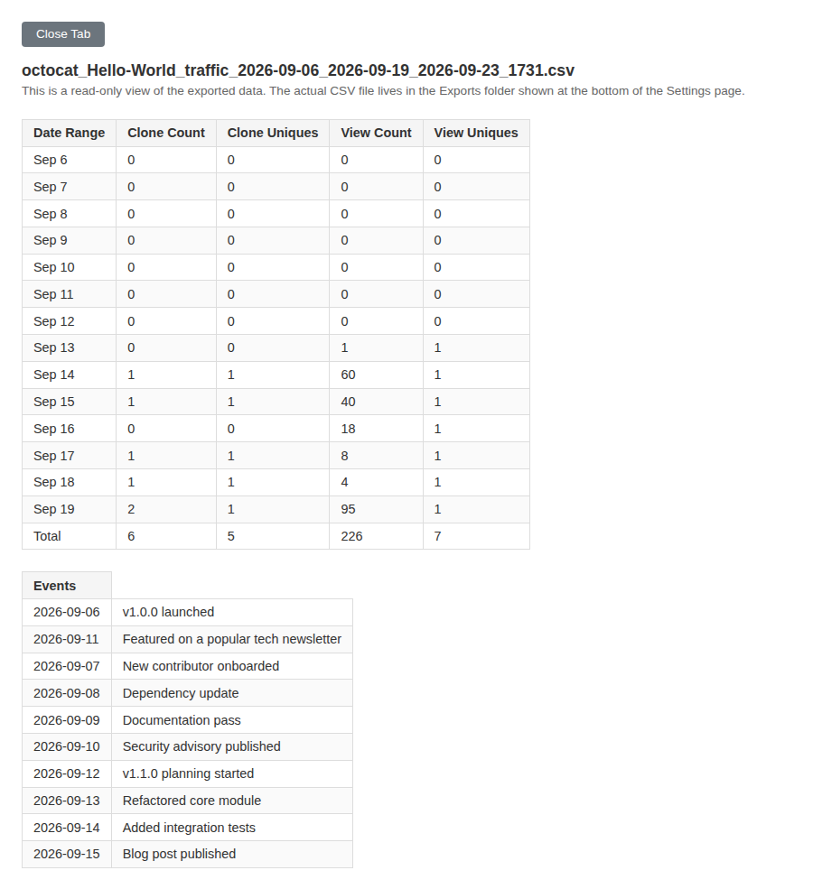

## System requirements

GitPerennial is small and light. It runs quietly in the background and only
wakes up a few times a day to check GitHub, so almost any computer from the
last several years runs it comfortably. Here is what it needs.

**All platforms**

| | Recommended |
|---|---|
| Processor | 64-bit, 2 cores or more. When idle the app uses well under 1% of one core. |
| Memory (RAM) | 4 GB or more. The background service uses roughly 130–210 MB and the tray icon about 100 MB, plus your browser. |
| Disk space | About 1 GB free is plenty. The program is about 16 MB and the .NET runtime adds roughly 100 MB. Your data grows only about 1–2 MB per tracked repo per year (a rough estimate), plus a monthly database backup that is kept for 12 months. |
| Network | Internet access to GitHub (`api.github.com`). The license servers are contacted only when you activate a license. The dashboard is served only on your own computer (`localhost:5000`), so that port needs to be free. |
| Browser | Any current browser. A Chromium-based browser (Chrome, Edge, Brave) is recommended for printing — see [Printing reports](#printing-reports). |

For reference, we ran it comfortably on a machine with 2 CPU cores and about
4 GB of RAM, with a full desktop and a browser open at the same time.

**Windows**

- Windows 10 (version 1607 or later) or Windows 11, 64-bit (x64). Windows on
  ARM is not supported yet.
- Two free Microsoft runtimes, both **version 10, x64**: the **.NET 10 ASP.NET
  Core Runtime** (runs the app and dashboard) and the **.NET 10 Desktop
  Runtime** (runs the tray icon). Download both from
  [Microsoft's .NET 10 page](https://dotnet.microsoft.com/download/dotnet/10.0).
  Not sure you have them? In PowerShell run `dotnet --list-runtimes` — it should
  list `Microsoft.AspNetCore.App 10.` and `Microsoft.WindowsDesktop.App 10.`. If
  the command isn't found, neither is installed. If a runtime is missing,
  GitPerennial still installs but won't start.
- Administrator rights to install (the installer registers a Windows service).

**macOS**

- macOS 14 (Sonoma) or later, which is what Microsoft supports for .NET 10. We
  tested on macOS 26 (Tahoe).
- **An Apple silicon Mac (M1 or newer).** This is what nearly every Mac sold
  today is — Apple hasn't shipped a new Intel Mac since 2023 — and it's the
  only build we publish, test, and support right now. Intel support (a
  separate `osx-x64` build) isn't available yet; we may add it as a
  fast-follow release if there's real demand, the same way `.rpm` support
  is planned for Linux.
- The ASP.NET Core 10 runtime — see [Installing on macOS](#installing-on-macos).
- An administrator password during installation.

**Linux**

- A Debian- or Ubuntu-family distribution on 64-bit Intel/AMD (amd64) with
  systemd. **We tested on Ubuntu 24.04 with the MATE desktop — that is the
  only version we have verified.** The package is built on Ubuntu 24.04 and
  needs glibc 2.34 or newer, which Ubuntu 22.04 and Debian 12 and later meet, so
  it should install on them too — but we haven't tested any of them.
- The ASP.NET Core 10 runtime. On Ubuntu 24.04, `sudo apt install ./gitperennial.deb`
  installs it for you — we ran exactly that on a machine that didn't have the
  runtime, and apt pulled it in from Ubuntu's own package archive — see
  [Installing on Linux](#installing-on-linux).
- `sudo` (or root) to install.
- The tray icon is optional and needs a desktop with AppIndicator support (GNOME
  needs an extension) — a server with no desktop doesn't need it at all. Details
  are in the Linux section.

## Installing on Windows

> **Before you install:** Windows needs two free Microsoft .NET 10 runtimes —
> see [System requirements](#system-requirements).

1. Download `GitPerennial.msi` from the [Releases page](https://github.com/SC-Admin567/GitPerennial/releases).
2. Run it. The installer will:
   - Install GitPerennial into `C:\Program Files\GitPerennial\`.
   - Set itself up correctly in the background (silent, no window).
   - Register the background service that keeps polling GitHub even
     when the dashboard isn't open, and add GitPerennial shortcuts to
     your Start Menu and Desktop.
3. Once installed, use the **GitPerennial** tray icon (bottom-right of
   your taskbar) to open the dashboard, and start/stop the background
   service.

**Upgrading?** Just run the newer version's installer — it upgrades in
place, over your existing install, using the same database. Your
tracked repos and history are never touched by an upgrade.

**Uninstalling via Windows Settings:** Settings → Apps → Installed apps
→ search "GitPerennial" → **⋯** → Uninstall.

**Installing/uninstalling from the command line:**
```
msiexec /i GitPerennial.msi
msiexec /x GitPerennial.msi
```

**Same commands from PowerShell (elevated):**
```powershell
Start-Process -Verb RunAs -FilePath "msiexec.exe" -ArgumentList '/i "C:\path\to\GitPerennial.msi"' -Wait
Start-Process -Verb RunAs -FilePath "msiexec.exe" -ArgumentList '/x "C:\path\to\GitPerennial.msi"' -Wait
```

**Uninstalling?** Your database, backups, exports, prints, and logs all
live in your own `Documents\GitPerennial\` folder — completely separate
from the install folder (`C:\Program Files\GitPerennial\`) — and are
**not** removed when you uninstall the app. If you reinstall later, all
of your data — including your tracked repos and history — is still
there. (Note: uninstalling does **not** reset which repo is locked in
as your free-tier repo — see the FAQ below.)

## Installing on macOS

1. Download `GitPerennial.pkg` from the [Releases page](https://github.com/SC-Admin567/GitPerennial/releases).
2. Double-click it and follow the installer. It will:
   - Install GitPerennial into `/Applications/GitPerennial/`.
   - Run the app once, silently, to set itself up correctly.
   - Register the background service (a launchd LaunchDaemon) so it
     keeps polling GitHub even when nobody's logged in, and set up
     the tray icon to start automatically at login.
3. Once installed, look for the **GitPerennial** icon in your menu bar
   (top-right) to open the dashboard and start/stop the background
   service. You may need to log out and back in (or restart) once
   before the tray icon first appears.

**What to expect during setup — macOS shows a few standard security
prompts, on purpose, for any app like this.** None of them are
GitPerennial-specific, and none of them mean anything is wrong —
we'd rather tell you exactly what's coming than have you second-guess
a real prompt from your own Mac:

1. **"GitPerennial can't be opened because it is from an unidentified
   developer"** (Gatekeeper), the first time you open the `.pkg`. The
   installer isn't code-signed yet — the exact same warning Windows
   shows for an unsigned installer, not specific to GitPerennial.
   Right-click (or Control-click) the `.pkg` and choose **Open**, or
   allow it once in **System Settings → Privacy & Security**.
2. **"'dotnet' would like to access files in your Documents folder"**,
   once, during first-run setup. It says "dotnet," not "GitPerennial" —
   that's macOS naming the .NET runtime GitPerennial runs on, not a
   separate app; this is normal and expected. This is where GitPerennial
   stores YOUR OWN backups, logs, exports, and saved reports — nothing
   is uploaded anywhere. Click **Allow**. Apple gates every app that
   touches Documents this way, regardless of how ordinary the use is —
   see the FAQ below for more. **This dialog can only appear while you
   are actually logged into the Mac** (macOS has no way to show it to a
   background service with nobody signed in) — if the installer runs
   with nobody logged in yet (rare — only happens on an unattended or
   remote-driven install), log in normally afterward and the dialog
   will appear then; approving it once covers every future GitPerennial
   install/upgrade on that Mac, since the grant is tied to the .NET
   runtime's own signature, not GitPerennial's.
3. **"App Background Activity"**, a plain notification (not a question
   — there's nothing to click) the first time each background piece
   registers itself. It does not say "GitPerennial" — macOS names
   whoever actually signed the binary: the background service shows
   as **"Software from 'Microsoft Corporation' can run in the
   background"** (it runs on the signed .NET runtime), and the tray
   icon shows as coming from an **unidentified/unknown developer**
   (it isn't code-signed yet, same as the installer itself — see the
   Gatekeeper note above). Either way, it's macOS telling you where to
   find the on/off switch (System Settings → General → Login Items &
   Extensions) if you ever want it — the same notification you'd get
   installing Dropbox, Slack, or any other menu-bar app.

None of these repeat on every launch — each fires once, ever, per
install. We're documenting them here plainly rather than hoping you
don't notice, because we'd rather you trust what you're installing
than wonder.

**Requires the ASP.NET Core 10 runtime, same as Linux.** The `.pkg`
does not bundle its own .NET runtime — install it once via Microsoft's
own installer if you don't already have it:
```
curl -sSL https://dot.net/v1/dotnet-install.sh | bash /dev/stdin --channel 10.0 --runtime aspnetcore
```
Or download the "ASP.NET Core Runtime 10.0" installer package directly
from [Microsoft's .NET download page](https://dotnet.microsoft.com/download/dotnet/10.0)
(pick the arm64 installer for Apple Silicon Macs, x64 for Intel Macs) if
you'd rather not use the command line.

**Upgrading?** Run the newer version's `.pkg` the same way — it
installs over your existing copy at the same location, using the same
database. Your tracked repos and history are never touched.

**Uninstalling:** macOS installers (`.pkg` files) have no built-in
uninstaller — this is a limitation of the format itself, not something
specific to GitPerennial. Open `/Applications/GitPerennial/` and
double-click **Uninstall.command**. It stops the background service,
removes the app and its tray icon, and asks for your admin password
along the way — your data, **including your actual database**, lives
entirely under `~/Documents/GitPerennial/` (never inside the install
folder itself, on any platform), so it's left completely untouched
even though Uninstall.command removes the whole `/Applications/
GitPerennial/` folder.

## Installing on Linux

**Debian, Ubuntu, and derivatives (Mint, Pop!\_OS, Zorin, elementary,
and similar) — `.deb`:**

1. Download `gitperennial.deb` from the [Releases page](https://github.com/SC-Admin567/GitPerennial/releases).
2. Install it:
   ```
   sudo apt install ./gitperennial.deb
   ```
   (or `sudo dpkg -i gitperennial.deb`). Run it with `sudo` from your
   own account rather than from a root shell — the installer needs to
   know which user to set GitPerennial up for (see "Installing from a
   root shell?" below if that isn't possible). This will:
   - Install GitPerennial into `/opt/gitperennial/`.
   - Run the app once, silently, as you (not root) to set itself up
     correctly.
   - Register the background service as a systemd `--user` service and
     turn on **"linger"** for your account, so the service starts when
     the machine boots — even before anyone has logged in — and keeps
     polling GitHub. (Without linger, a `--user` service only runs
     while you're logged in, so collection would quietly pause after
     every reboot until you logged back in.) The installer then checks
     that the service is really running the version it just installed,
     restarts it if not, and tells you plainly if it can't.
   - Add GitPerennial to your Applications menu, put two icons on your
     Desktop — **GitPerennial** (launches the tray icon) and
     **GitPerennial Documentation** — and set the tray icon to start
     automatically at login. Both Desktop icons are yours to delete if
     you don't want them. **GitPerennial Documentation** opens this
     same GitHub repository directly in your browser — always the
     current README and QUICKSTART, rendered by GitHub's own Markdown
     viewer, so you never need a separate app just to read `.md` files
     nicely.

     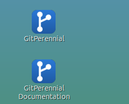
3. Once installed, look for the **GitPerennial** icon in your system
   tray (see the tray-icon notes below if it doesn't appear). Its menu:
   - **Start Service** / **Stop Service** — start or stop the
     background service. A **green dot beside Start Service** means the
     service is running; a **red dot beside Stop Service** means it's
     stopped. Each click shows a confirmation popup, and Start Service
     also opens the dashboard in your default browser.
   - **Open Dashboard** — opens the dashboard in your default browser.
     This works even while the background service is stopped, so you
     can always look at your data; it doesn't turn the background
     service on. (When the service is stopped it starts a temporary,
     standalone copy of the app to serve the dashboard — that copy also
     polls GitHub and uses port 5000 until you click **Start Service**
     or **Stop Service**.)
   - **Exit** — closes only the tray icon. The background service keeps
     running and collecting data. Relaunch the tray from the Desktop
     icon or the Applications menu whenever you want it back.

   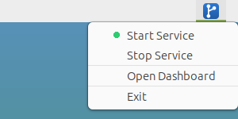

**Requires the ASP.NET Core 10 runtime.** The `.deb` does not bundle
its own .NET runtime, so the machine needs the ASP.NET Core 10 runtime
installed. On **Ubuntu 24.04** it's in Ubuntu's own package archive
(we've confirmed that), and it's listed as a *recommended* package of
the `.deb` — so `sudo apt install ./gitperennial.deb` installs it for
you, because apt installs recommended packages by default. (We ran
exactly that on Ubuntu 24.04 with the runtime missing, and it was
pulled in automatically.) If you installed with `dpkg -i` — which
ignores recommendations — or apt didn't pull it in, install it
yourself:
```
sudo apt install aspnetcore-runtime-10.0
```
**Other distributions:** check whether your own archive carries it
(`apt search aspnetcore-runtime-10.0`). If it doesn't (Debian, for
example), use Microsoft's package feed instead — change the
`ubuntu/24.04` in the URL to match your actual distro and version, per
[Microsoft's install docs](https://learn.microsoft.com/dotnet/core/install/linux):
```
wget https://packages.microsoft.com/config/ubuntu/24.04/packages-microsoft-prod.deb -O packages-microsoft-prod.deb
sudo dpkg -i packages-microsoft-prod.deb
sudo apt update
sudo apt install -y aspnetcore-runtime-10.0
```
Not sure whether you have it? `dotnet --list-runtimes` should list a
`Microsoft.AspNetCore.App 10.x` line. If it's missing, the installer
prints a clear warning with these same commands and carries on —
GitPerennial simply won't start until the runtime is installed.

**Tray icon quirks by desktop — read this if it doesn't show up, or
misbehaves.** The tray icon uses the standard Linux "AppIndicator"
protocol, which every major desktop supports *in principle*, but in
practice needs different things depending on what you run. Honest
status below — some of this we've verified ourselves, some is the
standard, expected behavior we haven't independently tested:

- **GNOME (Ubuntu's default desktop) — well-documented requirement, but
  not tested by us.** GNOME Shell has no built-in system tray at all;
  that's GNOME's own long-standing design, not a GitPerennial bug. We
  haven't been able to run GitPerennial on a real GNOME desktop
  ourselves yet, so this is the standard, widely documented fix rather
  than something we've confirmed: install the **"AppIndicator and
  KStatusNotifierItem Support"** extension (from
  [extensions.gnome.org](https://extensions.gnome.org/), or
  `sudo apt install gnome-shell-extension-appindicator` on Ubuntu),
  then log out and back in. Without it, expect no icon. (The installer
  prints this same note when it detects GNOME.)
- **XFCE — verified, has a known real limitation.** The tray icon
  works, but XFCE's own panel has a long-standing upstream bug
  ([xfce4-panel#574](https://gitlab.xfce.org/xfce/xfce4-panel/-/issues/574),
  reported in 2022 and closed upstream without a fix; none of the
  xfce4-panel releases through 4.20.8 lists one): after using
  **Exit** from the tray menu and relaunching it, the icon may not
  reappear until you run `xfce4-panel --restart` (or log out and back
  in). This is an XFCE limitation, not something GitPerennial can fix
  from its own code — if you hit it, that command recovers it.
- **MATE — verified, needs two extra packages on a minimal install.**
  We've run GitPerennial on MATE ourselves, including choosing **Exit**
  and relaunching, which works cleanly here (unlike XFCE, above). A
  default "Ubuntu MATE" desktop is expected to include these packages
  already, but a minimal/custom MATE setup may not:
  ```
  sudo apt install ayatana-indicator-application mate-indicator-applet
  ```
  If the icon still doesn't appear after that, your panel's own layout
  may not have an indicator applet added — right-click the panel →
  **Add to Panel** → **Indicator Applet Complete**.
- **KDE Plasma, Cinnamon, and other desktops — expected to work, not
  independently tested by us.** These support the same
  StatusNotifierItem/AppIndicator protocol GNOME's extension and
  MATE's indicator applet both implement, so the tray icon should work
  with no extra step. We haven't run GitPerennial on either ourselves,
  so treat this as "should work," not "confirmed."
- **Whatever your desktop, the tray icon is a convenience, not a
  requirement.** The background service and dashboard don't depend on
  it at all — if it never appears, or you're on a desktop we haven't
  covered above, just browse to `http://localhost:5000` directly and
  manage the service from a terminal, **as your own user (not with
  `sudo`** — it's a per-user service):
  ```
  systemctl --user status gitperennial
  systemctl --user start gitperennial
  systemctl --user stop gitperennial
  ```

**Headless server, no desktop at all?** GitPerennial works fine —
the tray icon is entirely optional. Just install as above; the
background service and browser dashboard (`http://localhost:5000`)
don't need a desktop environment to run, and because the installer
turns on "linger" the service starts at boot with nobody logged in.
The dashboard deliberately listens only on the server itself
(`localhost`), so it's never exposed to your network. To view it from
another computer, forward the port over SSH and then browse to
`http://localhost:5000` on your own machine:
```
ssh -L 5000:localhost:5000 you@your-server
```

**Installing from a root shell?** The installer finds out which user
account to set GitPerennial up for from `sudo`. If you install from a
plain root login instead (no `sudo`), it skips the per-user setup and
prints what to do: run `/opt/gitperennial/GitPerennial.App` once as
your own regular (non-root) user, stop it with Ctrl+C, then run
`/opt/gitperennial/GitPerennial.App --install-service`. For start-at-boot
also run `sudo loginctl enable-linger your-user`.

**Upgrading?** Install the newer `.deb` the same way — `apt`/`dpkg`
upgrades in place over your existing install, using the same database.
The installer then makes sure the background service is running the new
version (restarting it if needed) and says so loudly if it can't.

**Uninstalling:**
```
sudo apt remove gitperennial
```
This stops and unregisters the background service, removes the program
files under `/opt/gitperennial/`, and removes the Applications-menu,
autostart, and Desktop entries the installer created. If the installer
was the one that turned on "linger" for your account, it turns it back
off; if you'd already enabled linger yourself, it's left alone. Your
data — including your actual database — lives entirely under
`~/Documents/GitPerennial/` (never inside `/opt/gitperennial/`, same
as on Windows and macOS; if your desktop keeps your Documents folder
somewhere else, GitPerennial follows it), so it's never touched.

**Something not working? Where to look on Linux:**
- **Is the runtime installed?** `dotnet --list-runtimes` should show a
  `Microsoft.AspNetCore.App 10.x` line (see above if not).
- **Is the service running?** `systemctl --user status gitperennial`
  (as your own user). Its log: `journalctl --user -u gitperennial`.
  GitPerennial also writes its own log files under
  `~/Documents/GitPerennial/logs/`.
- **Dashboard won't load?** GitPerennial uses port 5000 on your own
  machine. If another program is already using that port,
  GitPerennial can't start its dashboard.
- **Printing a report in landscape comes out wrong?** Ubuntu's default
  browser is Firefox, which has the landscape table-printing issue
  described in the FAQ below. Install Chrome (or another
  Chromium-based browser) for printing.

**Other Linux distributions (Fedora, RHEL, openSUSE, Arch, etc.):**
not supported yet. A `.rpm` package for the Fedora/RHEL/openSUSE
family is planned as a fast-follow release.

## Setting up your GitHub token

GitPerennial needs a GitHub Personal Access Token (PAT) to read your
repos' traffic and release data. GitHub offers two kinds of PAT, and
either works. **If you're not sure which to pick, use classic** — it's
simpler and has no gotchas as you add more repos later. Pick
fine-grained if you specifically want to limit the token to only the
repos you're tracking, and you're comfortable remembering to update
its repository list yourself whenever you add another repo. In
Settings, paste in a token with **no expiration** (or the longest
expiration you're comfortable with) — GitPerennial will warn you well
before it expires so you're never caught off guard.

To create your Personal Access Tokens, login to your Github account and
go to [Developer Settings](https://github.com/settings/apps).

**Classic PAT** (simpler — one scope covers everything):
[Tokens (classic)](https://github.com/settings/tokens)
- Just the **`repo`** scope. That's it.

**Fine-grained PAT** (more precise — scoped to only the repo(s) you
pick, but needs its own repository access and 3 separate permissions
set, all **Read-only**):
[Fine-grained tokens](https://github.com/settings/personal-access-tokens)
- **Repository access**: choose "All repositories," or "Only select
  repositories" and pick the one(s) you're tracking. **Unlike a
  classic PAT (which automatically covers every repo you have access
  to), a fine-grained PAT only works for the repos it's explicitly
  given access to.** If you later track an additional repo in
  GitPerennial's Settings, remember to also add that repo to this
  same token's repository access list — adding it in GitPerennial
  alone isn't enough, and you'll otherwise see it fail to sync with no
  obvious reason why.
- **Administration** — Read-only
- **Contents** — Read-only
- **Issues** — Read-only

(GitHub's fine-grained PATs also always include a **Metadata**
permission automatically, at Read-only, whenever any other permission
is granted — you don't need to set it yourself.)

Note: GitHub's traffic endpoints (clones, views, referrers, popular
content) require **push access** to a repo, not just read access —
this is a GitHub API requirement, not a GitPerennial one, and applies
to both public and private repos. This is why a fine-grained PAT needs
**Administration**, not just Contents — Administration is what
actually grants that traffic-endpoint access on a fine-grained token.
Everything GitPerennial does is read-only regardless of which token
type you use; write-level scopes are never needed.

## Printing reports

**For the most reliable results, we recommend Chrome for printing**
(Windows, macOS, or Linux — Chrome is a free download on all three).
It's been the most thoroughly tested browser for both portrait and
landscape printing, and other Chromium-based browsers (Edge, Brave)
should work just as well since they share the same underlying engine.
(See the FAQ below for a known issue with landscape table reports in
some other browsers.)

**Print Report** (a data table) and **Print Charts** (the visual
charts, in portrait or landscape) each open in a new tab, ready to
print or save as a PDF from your browser's own print dialog:

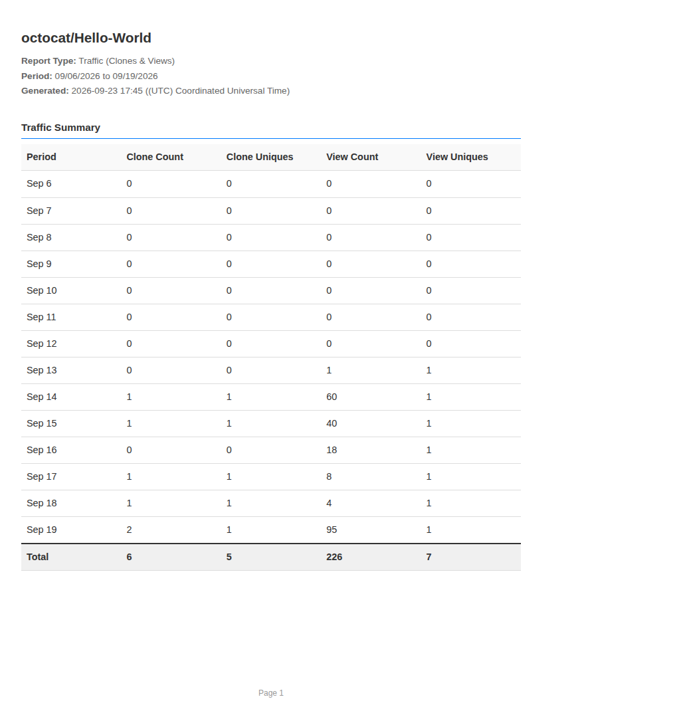

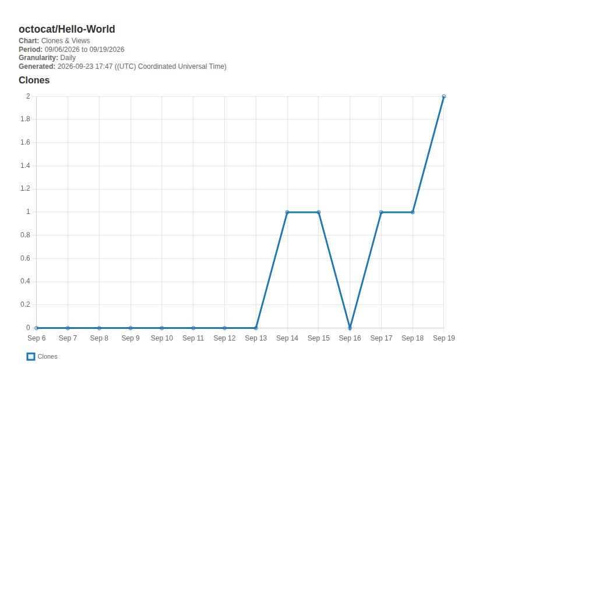

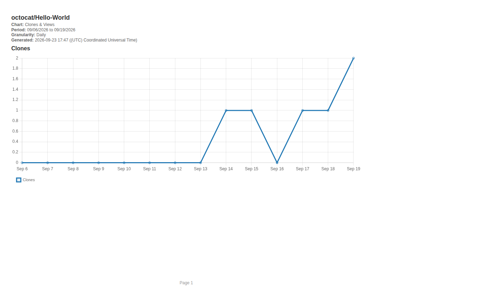

## Licensing & renewal

- **Free tier:** track 1 repo, forever, full feature depth.
- **Perpetual license:** a one-time purchase that unlocks tracking any
  number of repos, on the version you bought, forever.
- **Annual renewal:** optional — keeps you eligible for future major
  versions. If you don't renew, the version you already have keeps
  working exactly as it does today; you just won't be able to update to
  a newer major version until you do.

A license unlocks tracking as many repos as you want, each with its
own sync status, right on the same dashboard — and GitPerennial warns
you proactively instead of just quietly failing. *(Two of the three
repos below, and the token-expiry warning, are added for illustration
— GitPerennial doesn't come pre-loaded with any repos or warnings.)*

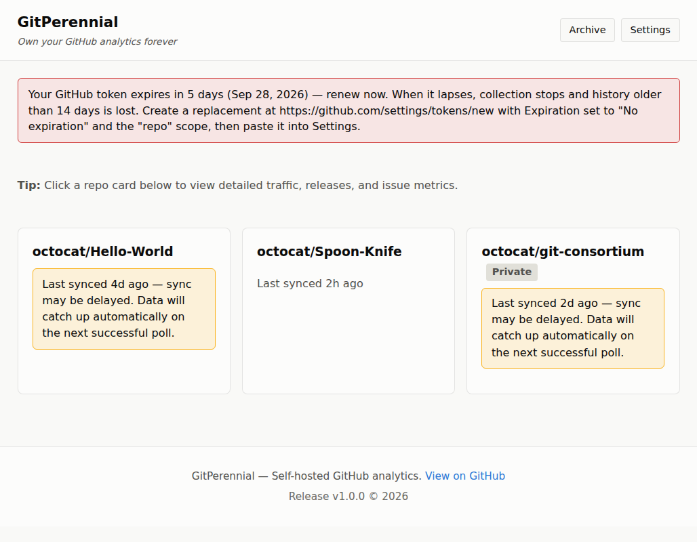

## FAQ

**Why does GitPerennial ask for Documents folder access the first time
I run it (macOS)?**
This is where GitPerennial stores YOUR OWN backups, logs, exports, and
saved reports — nothing is uploaded anywhere. Click Allow (the dialog
says "dotnet," not "GitPerennial" — see the installer note above). The
installer's own setup step normally triggers and answers this before
the background service ever starts, so most installs never see it
matter. If the background service ever does start before that grant
exists (e.g. you install with nobody logged into the Mac yet), it will
exit with a database error and macOS's launchd will keep retrying it
in a loop — log in normally, wait for the dialog, click Allow, and the
service recovers on its own within a few seconds with no reinstall
needed.

**I saw several macOS security prompts/notifications when I installed
GitPerennial (unidentified developer, Documents access, background
activity) — is this legitimate software?**
Yes — every one of those is a standard macOS gate that applies to any
comparable app, not something GitPerennial triggers because of what it
does. See [What to expect during setup](#installing-on-macos) in the
macOS install section above for exactly what each one means and why —
we'd rather list them plainly than have you wonder. None of them repeat
after the first install.

**I uninstalled and reinstalled — why is my free-tier repo still
locked to the same one?**
This is by design, to prevent free-tier repo swapping. Uninstalling
does not reset it. If your original repo is genuinely gone (deleted,
made private, or you lost access) rather than just "I want to switch,"
GitPerennial can detect that and offer to unlock a new free repo after
a short waiting period — see Settings for details.

**I lost my license key — how do I get it back?**
Open Settings — if GitPerennial is still installed on the same
computer, a "Reactivate my saved license" button will fill it back in
for you. If that computer's drive failed, or you're on a new computer,
use the "Email support for your key" link instead.

**I printed a report in landscape and the first page came out blank —
is my data missing?**
No, your data is fine — this is a known rendering issue in some
browsers when printing a multi-page table report in landscape
orientation: the header prints, but the table itself starts on page 2
instead of page 1. Switching to Chrome for printing resolves it (see
[Printing reports](#printing-reports) above); portrait printing is
unaffected either way.

**Does GitPerennial keep collecting after a reboot, before I log in
(Linux)?**
Yes. The installer turns on "linger" for your account, which lets your
systemd `--user` service start at boot instead of waiting for a login.
You can check with `loginctl show-user $USER --property=Linger` (it
should say `Linger=yes`). If it doesn't, run
`sudo loginctl enable-linger $USER`.

**The tray icon doesn't show up on Linux — is something broken?**
Almost certainly not: it depends on your desktop. See "Tray icon
quirks by desktop" in the Linux install section above — GNOME needs an
extension, a minimal MATE install needs two packages, XFCE has one
upstream quirk. The service and dashboard work either way; just browse
to `http://localhost:5000`.

## Support

Bug reports, feature requests, and general questions: please open an
[Issue](https://github.com/SC-Admin567/GitPerennial/issues) — see
[CONTRIBUTING.md](CONTRIBUTING.md) for what to include.

For license recovery or anything sensitive that shouldn't go in a
public issue:
**gitperennial-support@shallcross-consulting.com**
